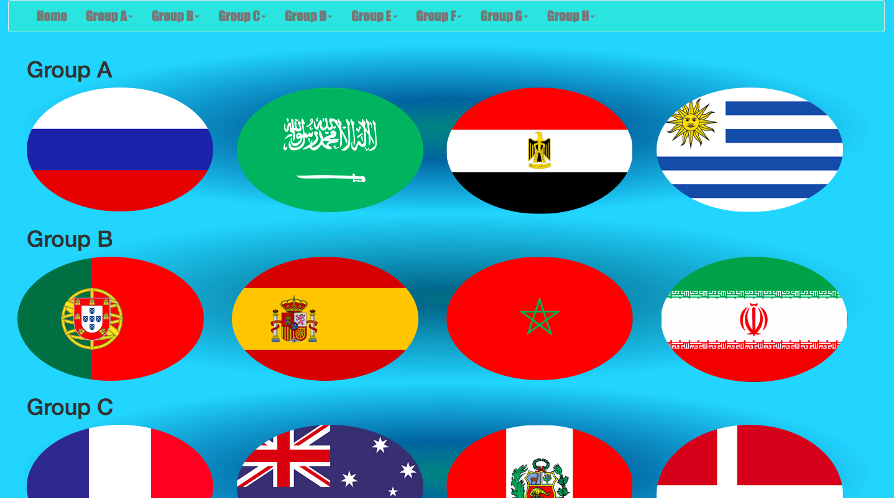

# sparta global project webpage

Instructions for use:

* To use this project git clone the repository to your computer
* Enter the project and open the html file. To view the code you can open the html file in a text editor.

For this project I was tasked with making a website of my choice using HTML5 and CSS3, including bootstrap. I chose to base my website on the 2018 Russian World Cup, more specifically the countries/teams participating and the groups they were in.

## Features

* landing page - links to individual teams
* zoom on hover of individual countries
* fully functional navigation bar at the top of landing
* responsive landing page to handheld devices
* team page - with details on individual Teams
* functional side navigation bar
* responsive team page

